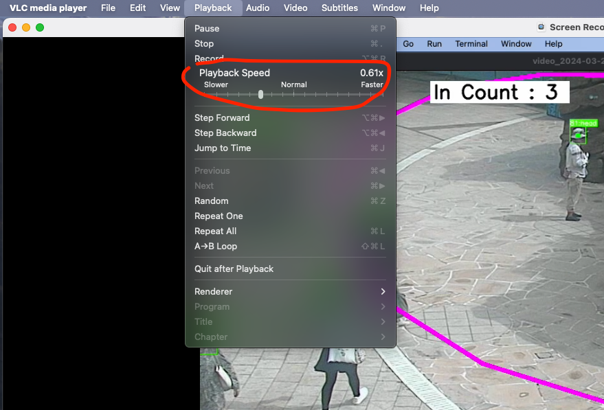
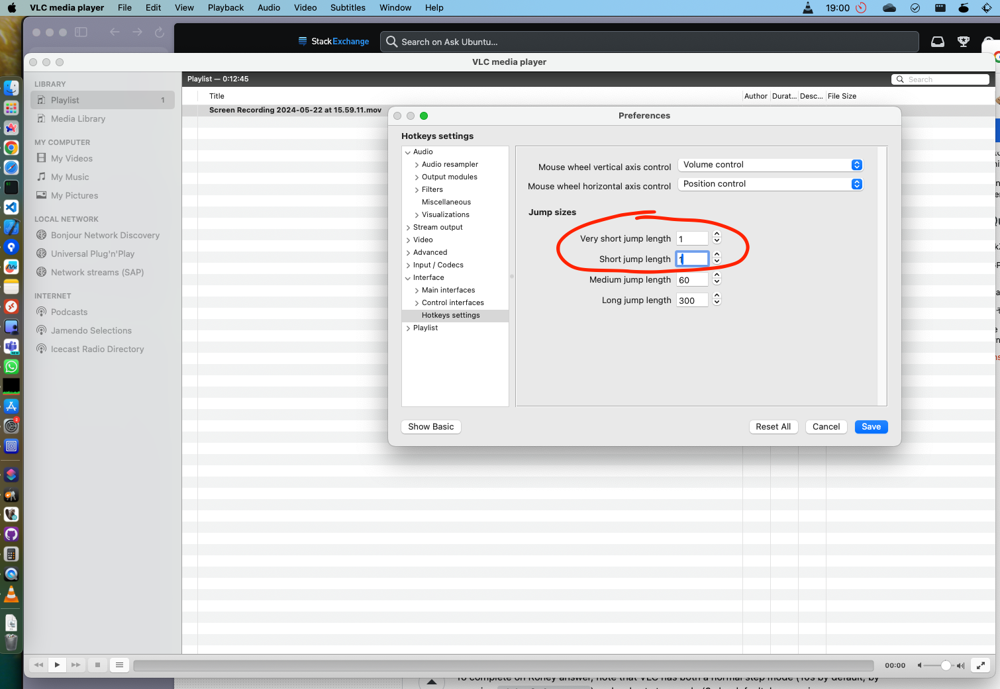

# People-Count In/Out Results Verification Process

## Objective
To verify the accuracy of in/out counts in a 10-minute video using VLC Player. Report any discrepancies found during the verification process.

## Tools Required
- VLC Media Player
- The video file to be verified (10 minutes long)
- A log or record of expected in/out counts for reference

## Instructions

### Step 1: Setup
1. **Open VLC Media Player:**
   - Launch VLC Media Player on your computer.
   
2. **Load the Video:**
   - Go to `Media` > `Open File`.
   - Select and open the 10-minute video file you need to verify.

### Step 2: Playback Controls
1. **Playback Speed:**
   - Adjust the playback speed if necessary for easier verification. Use `Playback` > `Speed` to slow down or speed up the video.

2. **Frame-by-Frame Navigation:**
   - Use the left and right arrow keys to move back and forth frame-by-frame (adjust back/forth to 1 second like following screenshot) to accurately verify each count.

### Step 3: Verification Process
1. **Start Playback:**
   - Begin playing the video and closely monitor the points where people enter and exit region area. (when 'in count','out count' +1)

2. **Pause at Each Count:**
   - When you observe a person entering or exiting, pause the video if not confident.
   - Use the arrow keys to move frame-by-frame and note the exact timestamp.

3. **Record Observations:**
   - It's better to closely monitor the 'in count' and 'out count' label numbers so you can explain the reasons when they increase.
   - Compare the observed counts with the expected counts.
   - Log any discrepancies using the following format:
     - **In Count Discrepancies:**
       ```text
       in count @ [timestamp] missing 1 count 
       ```
     - **Out Count Discrepancies:**
       ```text
       out count @ [timestamp] overcount 1
       ```
     - **Incorrect In Count:**
       ```text
       in count @ [timestamp] overcount 1
       ```
### Special Cases

1. **Hidden Child:**
   - If a child is hidden behind an adult when crossing the line, the hidden child should still be counted.
   - If a person is hidden under an umbrella or a similar object, they should still be counted.
   - If a child is hidden in a stroller, the child should still be counted.

2. **Single Count per Person:**
   - Each person should be counted for in/out only once. If a person exists in the video, it should count as in/out one time at maximum.
   
3. **Re-entry as New Person:**
   - If a person completely leaves the video and then re-enters, they should be treated as a new person and counted again.

### Step 4: Reporting
1. **Document Findings:**
   - Create a document to record all discrepancies found during the verification process.
   - Use the format provided in Step 3 to log each issue.

2. **Summarize Results:**
   - Provide a summary of the total number of discrepancies found.
   - Include any patterns or recurring issues observed.

### Example Log Entry
Below is an example of how to document your findings


| Type | Timestamp | Missing | Overcount |
|------|-----------|---------|-----------|
| out  | 0:20      | 1       |           |
| out  | 2:07      | 1       |           |
| out  | 2:20      | 1       |           |
| in   | 2:50      | 1       |           |
| out  | 3:42      | 1       |           |
| out  | 4:20      | 1       |           |
| in   | 5:23      | 1       |           |
| in   | 5:31      | 1       |           |
| in   | 5:36      | 1       |           |
| out  | 7:15      |         | 1         |
| in   | 7:16      | 1       |           |
| out  | 7:21      |         | 1         |
| in   | 8:27      |         | 1         |
| out  | 8:27      |         | 1         |
| in   | 8:37      | 1       |           |
| out  | 8:42      |         | 2         |

#### Summary

- **Total discrepancies:**
  - `in count`: +2 overcount
  - `out count`: +10 overcount

- **Observations:**
  - 17  `in count` missing
  - 20  `in count` overcount

  - 6  `out count` missing
  - 16 `out count` overcount

### Final Steps
1. **Review:**
   - Double-check your recorded observations to ensure accuracy.
   - Make any necessary corrections.

2. **Submit Report:**
   - Submit the final verification report to the designated team or individual responsible for addressing the discrepancies.

---

By following these instructions, you should be able to accurately verify the people-count results and document any issues found during the playback of the video.