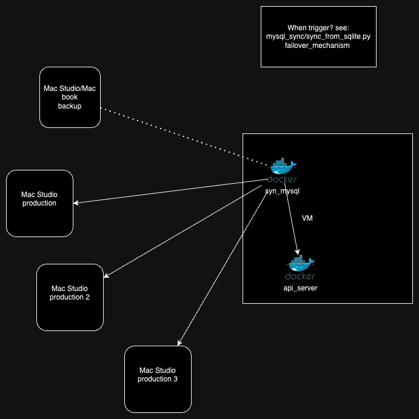

# People Count System Backup Plan

There is only one Mac Studio running for production. However, another Mac Studio is ready for backup within 30 minutes. The backup Mac Studio's PCS software is automatically updated by Jenkins each time the production one is updated.

Currently, only the Mac Studio PCS SQLite part has a backup. The VM part (for MySQL) does not have a backup. In case the MySQL VM crashes, the SQLite part should not have any data loss and can be synchronized to the MySQL VM later.

### Auto Start Backup:

The pcs_docker_sync docker container will automatically start the backup if the production Mac Studio becomes inaccessible. Open http://192.168.xx.xx:5000 to check if the people count system is running. If not, please follow the manual start backup procedure below.

### Manual Start Backup:

Ensure the backup Mac Studio is running; you can ping 192.168.xx.xx to test it. On Windows, use VNC (or MacOS Screen Sharing) to log in to the backup Mac Studio using the account "username" with password "xxxx". The entire people count system should start automatically after login.

If the manual process above does not work, please try following steps, like mentioned in the [PCS installation manual](../README.md).

```
conda activate pcs
python start_people_count.py
```

You should see the PCS python windows after the above steps. And check various docker containers to see if they are running, see "Docker Componments" in the [PCS installation manual](../README.md).

restart sync_docker to resume to original mac studio

how to stop backup mac studio? Just reboot the backup mac studio and login again.

### Implementation logic details:

see: mysql_sync/sync_from_sqlite.py

It manages multiple production hosts and one backup host, considering their priorities:

1. Only one backup host is used at a time.
2. Priorities are considered when multiple production hosts fail.
3. The backup process is started for the highest priority failed host.
4. If a higher priority host fails while the backup is in use for a lower priority host, the backup will switch to the higher priority host.

   
