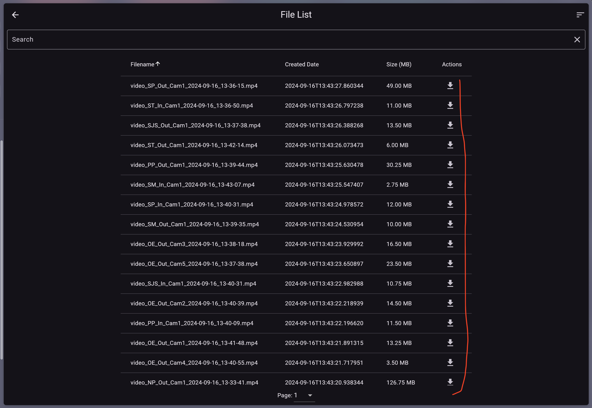
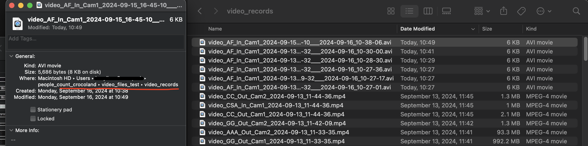
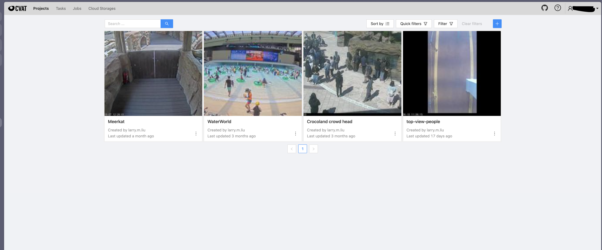
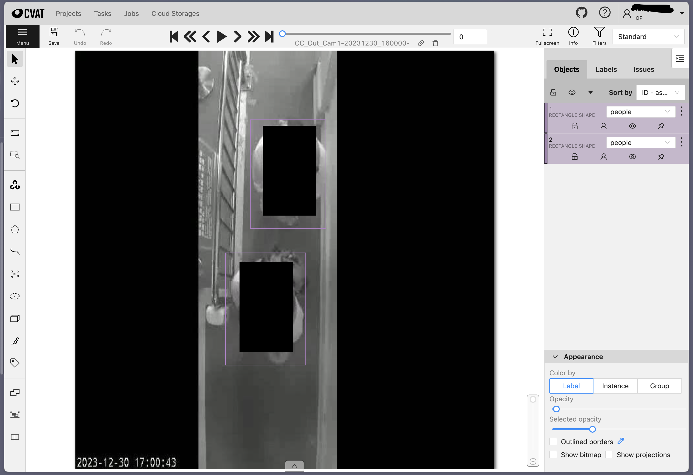
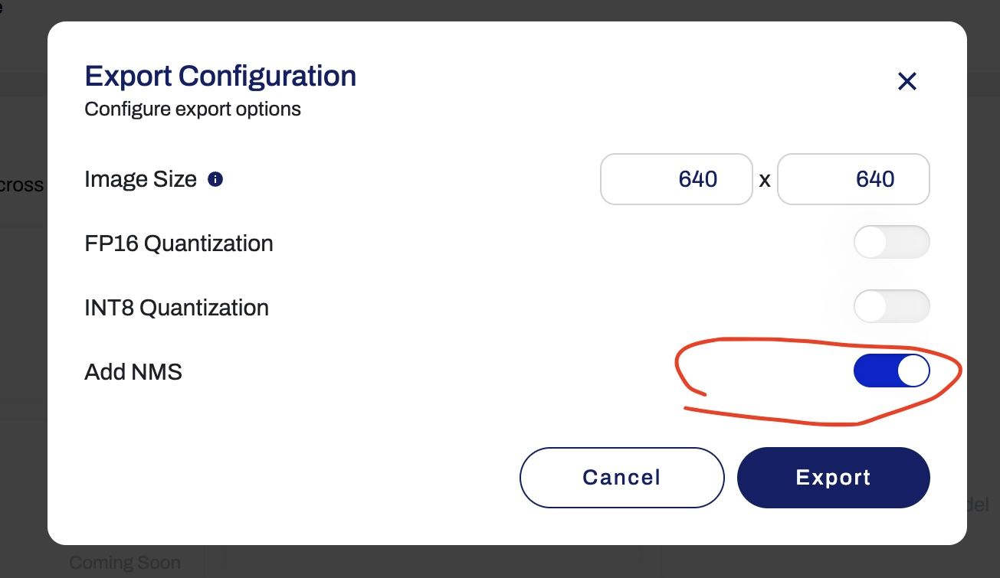
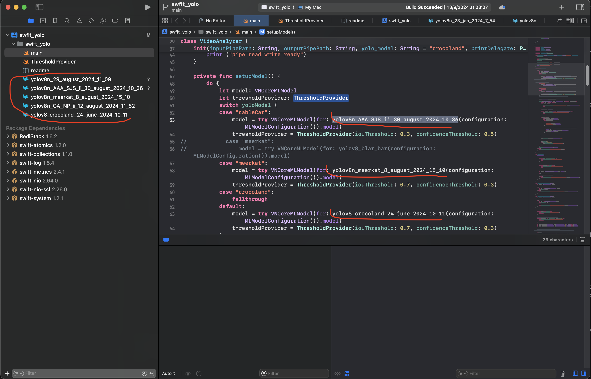
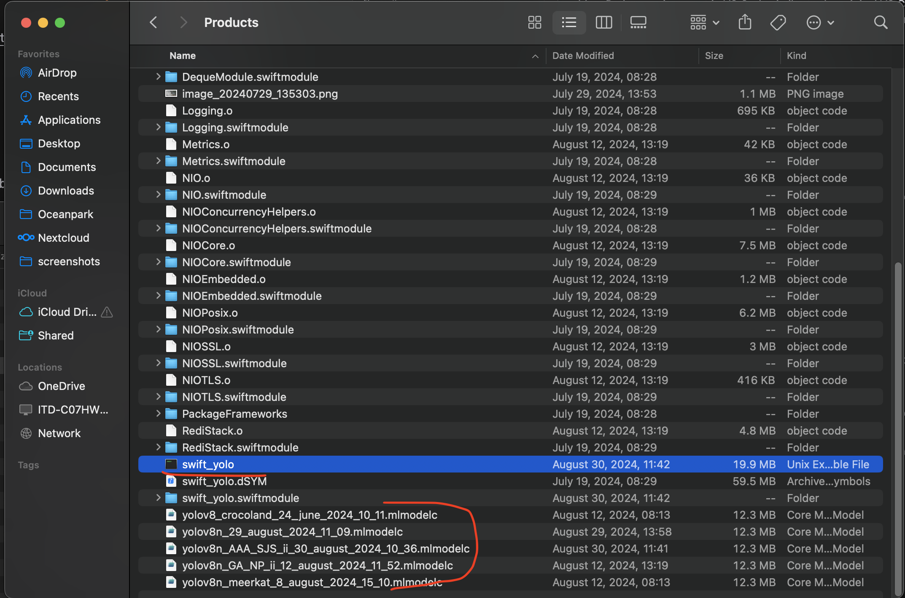

# How to add a new camera to the People Counting System?

## Pre-requisites

You'll need:

1. The camera's IP, username, password (currently using MJPEG,H264 for live video streams). The camera's video resolution should be 640x480, or other sizes such as 1920x1080, depending on the GPU's power.
2. A setup of the people_count_system, running on your device or server. See: [README.md](../README.md)

## Prepare dataset

### Add camera placeholder to the web inspect page

1. In `people_count_op` project, open `config_cameras_web_inpsect.json`
2. Add a line like this:
   ```json
   {"name": "COL_In_Cam1", "id": "COL_In_Cam1"}
   ```
   **Note**: The `id` must be unique and not equal to any existing camera id.
3. Run `python web_inspect.py` (or update the docker container)
4. You should see the new camera in the web page left panel:

   

### First-time verification of people count for the new camera

1. Save the camera's video using `people_count_op/save_video` docker container.
   
2. Download the video (typically from 10:00 am to 5:00 pm for higher foot traffic)

### Verify the people count for the new camera

Run the following command:


```bash
python main_and_swift_and_save_video.py your_path/video_XX_In_Cam1_2024-09-15_16-45-10.mp4 AF_In_Cam2 cableCar ''
```

For a custom counting region, modify the last parameter:

```bash
python main_and_swift_and_save_video.py your_path/video_XX_In_Cam1_2024-09-15_16-45-10.mp4 AF_In_Cam2 cableCar '[(0,70),(320,70),(320,120),(0,120)]'
```

After the command finishes, check the output video in `people_count_op/video_files_tools/video_records` folder:



For more accurate people counting, use the output video file for fine-tuning. See [People Count In/Out Results Verification Process](./People%20Count%20In%3AOut%20Results%20Verification%20Process.md)

## Annotation

### Prepare CVAT annotation data

1. Select an output video generated by the `main_and_swift_and_save_video.py` command
2. Extract frames in `people_count_op/dataset_process/`:
   ```bash
   python extract_frames.py your_path/video_XX_In_Cam1_2024-09-15_16-45-10.mp4
   ```
3. Compress the extracted images (in `./extracted_frames`) to a zip file
4. Upload to CVAT [CVAT Github](https://github.com/cvat-ai/cvat)

   

5. Annotate the images (use the excel table's timestamp if available)
Maybe you need to add at least one label (such as "people") in your CVAT project first; otherwise, CVAT will not let you annotate the images.
   

   **Note**: Annotation quality is crucial for final people counting accuracy.

### Prepare Yolov8 dataset format from CVAT Yolov1

See: [Yolo dataset prepare steps.md](../dataset_process/readme.md)

## Train

### Train on Ultralytics with Google Colab

1. Upload your prepared dataset to Ultralytics: https://hub.ultralytics.com/
  
2. Use default training parameters on the Ultralytics website

3. Train with Google Colab.

   **Note**: The fee is about 77.8 HKD for 100 compute units (usually enough for training several models in 3 months). As of September 2024, we prefer the A100 GPU for training. T4 is usable but slower.

   

## Deploy

1. After training, download the model file from Ultralytics
2. For use with Apple Swift on Apple machines:
   - Convert on the Ultralytics website
   - Enable 'NMS' support
   - Convert and download the model
   
   

   Or you can use 'apple_coreml_convert.py' under 'utils' folder to convert xxxx.pt model to apple CoreML model format.


3. In XCode IDE (NOT in VSCode), drag/import the downloaded Apple CoreML model file to the Xcode project in `people_count_op/xCode` folder
4. Update the Swift code to use the new model:
   

5. Build the Xcode project in release mode
6. Find the compiled swift binary files in the Xcode project's build folder (e.g., `/Users/username/Library/Developer/Xcode/DerivedData/swfit_yolo-gqqhyrfffctjifenpuypbuxoxzkh/Build/Products/Release`)
7. Copy the `swfit_yolo` binary and corresponding `.mlmodelc` to the `swift_compiled` folder:
   

8. Test the new model:
   ```bash
   python main_and_swift_and_save_video.py your_path/video_XX_In_Cam1_2024-09-15_16-45-10.mp4 AF_In_Cam2 cableCar '[(0,70),(320,70),(320,120),(0,120)]'
   ```

Check if you've achieved better people counting accuracy.
If everything OK, now you can add the new camera to the People Counting System 'start_people_count.py' file. 

1. Add a new line in the `commands` list, the meaning of last two parameters: couting region, couting direction, please refer to existing lines.
   ```python
   f"http://{env_vars['CC_PASS']}@192.168.1xx.2xx/mjpg/video.mjpg cableCar CC_In_Cam1 '' ''",
   ```
2. Run the People Counting System (it will automatically restart existing cameras and add the new one)
   ```bash
   python start_people_count.py
   ```

Go to web inspect page to see if it works.